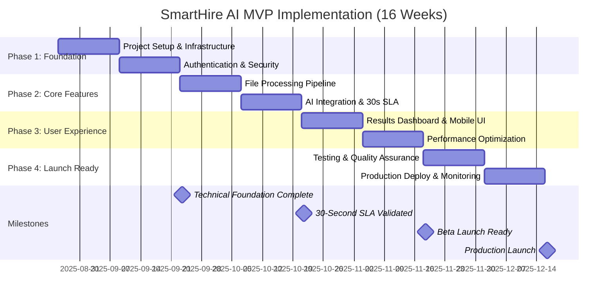

# SmartHire AI - Implementation Plan

**Document Type:** Project Implementation & Resource Planning  
**Version:** 1.0  
**Owner:** John (Product Manager)  
**Status:** Draft  
**Created:** August 24, 2025  
**Timeline:** 16 weeks (realistic scope-adjusted timeline)

---

## 📋 Implementation Overview

**Objective:** Execute SmartHire AI MVP development with disciplined scope management and realistic resource planning.

**Key Changes from Original Plan:**
- **Timeline Extended:** 8 weeks → 16 weeks (realistic for quality MVP)
- **Scope Reduced:** Focus on core CV-JD matching only (moved advanced features to roadmap)
- **Resource Approach:** Single full-stack developer with focused deliverables
- **Quality Focus:** Emphasis on 30-second SLA validation and cost management

---

## 🎯 Sprint Structure & Timeline

### Overall Timeline: 16 Weeks (4 Phases × 4 Weeks Each)

---

## 🏗️ Phase 1: Foundation (Weeks 1-4)

### Week 1-2: Project Infrastructure
**Primary Developer:** Full-stack engineer  
**Hours Estimate:** 60 hours

#### Sprint 1.1 Goals:
- [ ] **Next.js 14 Project Setup** (8 hours)
  - TypeScript configuration with strict mode
  - shadcn/ui component library integration
  - Tailwind CSS setup with mobile-first approach
  - Basic project structure and development workflows

- [ ] **Supabase Integration** (12 hours)  
  - Database setup with enhanced schema
  - Authentication configuration with RLS
  - Storage bucket setup for CV files
  - Basic environment configuration

- [ ] **Development Tooling** (6 hours)
  - ESLint and Prettier configuration  
  - GitHub Actions CI/CD pipeline
  - Testing framework setup (Jest + Testing Library)
  - Local development environment documentation

**Deliverables:**
- ✅ Working Next.js application deployed to Vercel
- ✅ Supabase backend configured and tested
- ✅ Development pipeline operational

### Week 3-4: Authentication & Security
**Hours Estimate:** 50 hours

#### Sprint 1.2 Goals:
- [ ] **User Authentication** (15 hours)
  - Supabase Auth integration with email/password
  - Protected routes and middleware
  - User profile management interface
  - Session handling and token refresh

- [ ] **Security Foundation** (20 hours)
  - Row Level Security (RLS) policies implementation
  - File upload security (validation, virus scanning)
  - API rate limiting and abuse prevention
  - Basic GDPR compliance (consent, data deletion)

- [ ] **Basic UI Framework** (15 hours)
  - Landing page with value proposition  
  - User registration and login flows
  - Dashboard shell with navigation
  - Mobile-responsive layout foundation

**Deliverables:**
- ✅ Secure user authentication system
- ✅ Basic UI framework with mobile optimization
- ✅ Security policies implemented and tested

**Phase 1 Success Criteria:**
- [ ] New users can register and log in securely
- [ ] Application loads on mobile devices with good UX
- [ ] Security audit passes with no critical vulnerabilities
- [ ] Development team can deploy changes confidently

---

## ⚡ Phase 2: Core Processing (Weeks 5-8)

### Week 5-6: File Processing Pipeline  
**Hours Estimate:** 65 hours

#### Sprint 2.1 Goals:
- [ ] **File Upload System** (20 hours)
  - Drag-and-drop interface with progress indicators
  - Batch upload capability (5-20 CVs)
  - File validation and error handling
  - Mobile-optimized upload experience

- [ ] **Document Parsing Engine** (25 hours)
  - PDF text extraction with pdf-parse
  - Word document processing with mammoth  
  - OCR integration for scanned documents (Tesseract.js)
  - Parallel processing pipeline for performance

- [ ] **Job Description Builder** (20 hours)
  - Template-based JD creation (5 role types)
  - Free-form JD input with validation
  - Save and reuse functionality
  - Mobile-friendly creation interface

**Deliverables:**
- ✅ Reliable file processing for all supported formats
- ✅ Job description creation with templates
- ✅ Mobile-optimized upload and creation flows

### Week 7-8: AI Integration & 30-Second SLA
**Hours Estimate:** 70 hours

#### Sprint 2.2 Goals:
- [ ] **AI Processing Pipeline** (30 hours)
  - OpenRouter integration with Claude 3.5 Haiku
  - Batch processing optimization for speed  
  - DeepSeek fallback implementation
  - Cost tracking and budget management

- [ ] **30-Second SLA Implementation** (25 hours)
  - Parallel processing architecture
  - Performance monitoring and alerting
  - Fallback strategies for SLA misses
  - Real-time progress indicators for users

- [ ] **Results Processing** (15 hours)
  - Structured AI response parsing
  - Match percentage calculation and validation
  - Result caching with Redis integration
  - Basic error handling and retry logic

**Critical Validation:**
- [ ] **30-Second SLA Testing** (Must pass before Phase 3)
  - Load test with 20 CVs against single JD
  - 95% success rate under normal conditions  
  - Graceful degradation when SLA at risk
  - Performance monitoring dashboard operational

**Deliverables:**
- ✅ AI processing pipeline meeting 30-second SLA
- ✅ Cost-optimized processing with fallbacks
- ✅ Performance monitoring and alerting

**Phase 2 Success Criteria:**
- [ ] 95% of CV batches (≤20 CVs) process within 30 seconds
- [ ] AI responses are structured and actionable
- [ ] Processing costs stay within $0.10 per analysis
- [ ] System handles failures gracefully with user feedback

---

## 📊 Phase 3: User Experience (Weeks 9-12)

### Week 9-10: Results Dashboard & Mobile UI
**Hours Estimate:** 60 hours

#### Sprint 3.1 Goals:
- [ ] **Match Results Interface** (25 hours)
  - Ranked candidate display with match percentages
  - Expandable detail views with AI reasoning
  - Color-coded scoring system (Green/Yellow/Red)
  - Quick action buttons (Interested/Maybe/Pass)

- [ ] **Mobile Optimization** (20 hours)
  - Touch-friendly interface with 44px+ targets
  - Progressive disclosure for complex information
  - Swipe gestures for candidate navigation
  - Responsive design testing across devices

- [ ] **Explainable AI Interface** (15 hours)
  - Clear presentation of AI reasoning
  - Matching skills and gaps visualization
  - Confidence score display and explanation
  - User feedback collection for AI improvement

**Deliverables:**
- ✅ Intuitive results dashboard with mobile optimization
- ✅ Clear AI explanations that users understand
- ✅ Quick decision-making interface for candidates

### Week 11-12: Performance Optimization & Polish
**Hours Estimate:** 55 hours

#### Sprint 3.2 Goals:
- [ ] **Performance Optimization** (25 hours)
  - Page load time optimization (<3 seconds)
  - Image and asset optimization  
  - Code splitting and lazy loading
  - Core Web Vitals optimization

- [ ] **User Experience Polish** (20 hours)
  - Error messaging and user guidance
  - Loading states and progress indicators
  - Onboarding flow and user education
  - Accessibility improvements (WCAG 2.1 AA)

- [ ] **Usage Management** (10 hours)
  - Usage tracking dashboard (analyses remaining)
  - Limit warnings and upgrade messaging
  - Processing history and analytics
  - Basic export functionality (PDF reports)

**Deliverables:**
- ✅ Fast-loading application with excellent mobile UX
- ✅ Clear user guidance and error handling
- ✅ Usage tracking and limit management

**Phase 3 Success Criteria:**
- [ ] Average page load time <3 seconds on mobile
- [ ] Users can complete full workflow on mobile devices
- [ ] 85% of users understand AI explanations (user testing)
- [ ] Core Web Vitals scores in "Good" range

---

## 🚀 Phase 4: Launch Preparation (Weeks 13-16)

### Week 13-14: Testing & Quality Assurance  
**Hours Estimate:** 50 hours

#### Sprint 4.1 Goals:
- [ ] **Comprehensive Testing** (25 hours)
  - Unit tests for critical business logic (>80% coverage)
  - Integration tests for AI processing pipeline
  - End-to-end tests for complete user workflows  
  - Performance testing for 30-second SLA validation

- [ ] **User Acceptance Testing** (15 hours)
  - Beta user recruitment (20 target users)
  - Structured feedback collection and analysis
  - Critical bug fixes and UX improvements
  - User onboarding optimization based on feedback

- [ ] **Security & Compliance Audit** (10 hours)
  - Penetration testing for critical vulnerabilities
  - GDPR compliance validation
  - Data retention and deletion testing
  - Privacy policy and terms of service finalization

**Deliverables:**
- ✅ Comprehensive test suite with high coverage
- ✅ Beta user validation of core workflows
- ✅ Security and compliance requirements met

### Week 15-16: Production Deployment & Monitoring
**Hours Estimate:** 45 hours

#### Sprint 4.2 Goals:
- [ ] **Production Infrastructure** (20 hours)
  - Production environment setup and configuration
  - Database optimization and backup strategies  
  - CDN and performance optimization
  - SSL certificates and security hardening

- [ ] **Monitoring & Alerting** (15 hours)
  - Performance monitoring dashboard (processing times, costs)
  - Error tracking and alerting (Sentry integration)
  - Usage analytics and business metrics
  - SLA monitoring and automatic alerts

- [ ] **Launch Preparation** (10 hours)
  - Documentation and user guides
  - Support processes and FAQ development
  - Marketing materials and landing page optimization
  - Launch checklist and rollback procedures

**Deliverables:**
- ✅ Production-ready application with monitoring
- ✅ Comprehensive documentation and support materials
- ✅ Launch procedures and contingency plans

**Phase 4 Success Criteria:**
- [ ] 99%+ uptime in production environment
- [ ] All monitoring and alerting systems operational
- [ ] 20+ beta users successfully complete workflows
- [ ] Launch checklist 100% complete with stakeholder approval

---

## 👥 Resource Planning & Team Structure

### Core Team (Minimum Viable Team)

**Primary Developer (Full-Stack Engineer)**
- **Commitment:** 35-40 hours/week for 16 weeks
- **Skills Required:** Next.js, TypeScript, PostgreSQL, AI API integration
- **Responsibilities:** 
  - Complete technical implementation
  - Code reviews and quality assurance
  - Performance optimization and debugging
  - Technical documentation

**Product Manager (Part-Time)**  
- **Commitment:** 10-15 hours/week for 16 weeks
- **Responsibilities:**
  - Sprint planning and stakeholder communication
  - User acceptance testing coordination  
  - Beta user recruitment and feedback collection
  - Go-to-market preparation

**Optional Roles (If Budget Allows):**
- **UI/UX Designer:** Mobile interface optimization (consulting basis)
- **DevOps Engineer:** Production deployment and monitoring (2-3 weeks)
- **QA Tester:** Comprehensive testing and bug identification (final 4 weeks)

### Skill Requirements Validation

**Must-Have Technical Skills:**
- [ ] **Next.js 14 + TypeScript:** Server Actions, App Router, performance optimization
- [ ] **PostgreSQL + Supabase:** Database design, RLS policies, vector search
- [ ] **AI API Integration:** OpenRouter, prompt engineering, cost optimization  
- [ ] **Mobile-First Development:** Responsive design, PWA, touch interfaces

**Nice-to-Have Skills:**
- [ ] Previous experience with AI/ML applications
- [ ] B2B SaaS development experience
- [ ] Performance optimization and monitoring
- [ ] Security and compliance best practices

---

## 💰 Budget & Cost Analysis

### Development Costs (16 Weeks)

| Resource | Rate | Hours | Total Cost |
|----------|------|--------|------------|
| **Senior Full-Stack Developer** | $75/hr | 580 hours | $43,500 |
| **Product Manager** | $60/hr | 200 hours | $12,000 |
| **UI/UX Design** (consulting) | $80/hr | 40 hours | $3,200 |
| **DevOps Setup** (consulting) | $85/hr | 32 hours | $2,720 |
| **QA Testing** (consulting) | $50/hr | 60 hours | $3,000 |
| **TOTAL DEVELOPMENT** | | | **$64,420** |

### Operational Costs (During Development)

| Service | Cost/Month | 4 Months | Notes |
|---------|------------|-----------|-------|
| **Supabase** | $0 | $0 | Free tier sufficient |
| **Vercel** | $0 | $0 | Free tier sufficient |
| **OpenRouter API** | $50 | $200 | Testing and development |
| **Redis (Upstash)** | $0 | $0 | Free tier sufficient |
| **Domain & SSL** | $15/year | $15 | One-time setup |
| **Monitoring Tools** | $25 | $100 | Basic monitoring stack |
| **TOTAL OPERATIONAL** | | **$315** | |

### Total Project Investment
**Development + Operational:** $64,735 for complete MVP

### Post-Launch Operational Costs (Monthly)
- **Infrastructure:** $8/month (validated for 100+ users)
- **Monitoring & Analytics:** $15/month
- **Support Tools:** $10/month
- **Total Monthly Operating Cost:** $33/month

---

## 📊 Risk Management & Mitigation

### High-Priority Risks

#### Technical Risks

**Risk 1: 30-Second SLA Failure**
- **Probability:** Medium (35%)
- **Impact:** High (core competitive advantage lost)  
- **Early Detection:** Weekly performance testing starting Week 6
- **Mitigation Plan:**
  - Prototype and validate processing pipeline in Week 5
  - Implement parallel processing architecture
  - Multiple fallback strategies (keyword matching, cached results)
  - Alternative AI providers ready for deployment

**Risk 2: AI Cost Overruns**
- **Probability:** Medium (30%)
- **Impact:** Medium (business model viability affected)
- **Early Detection:** Daily cost monitoring with alerts at $20/day
- **Mitigation Plan:**
  - Intelligent caching with 90% hit rate target
  - Multiple AI provider options with cost optimization
  - Usage limits and graceful degradation
  - Local processing fallbacks for common queries

#### Project Risks

**Risk 3: Scope Creep**
- **Probability:** High (60%)
- **Impact:** Medium (timeline and budget overruns)
- **Early Detection:** Weekly scope reviews with stakeholders
- **Mitigation Plan:**
  - Strict MVP definition with "out of scope" documentation
  - Change request process requiring stakeholder approval
  - Regular scope vs. timeline trade-off discussions
  - Future roadmap clearly defined for post-MVP features

**Risk 4: Single Developer Dependency**
- **Probability:** Low (15%)  
- **Impact:** High (project failure if developer unavailable)
- **Early Detection:** Weekly check-ins and code reviews
- **Mitigation Plan:**
  - Comprehensive documentation and code comments
  - Regular code commits with detailed descriptions
  - Knowledge transfer sessions with PM and stakeholders
  - Backup developer identified and briefed on architecture

### Success Dependencies

**External Dependencies:**
- ✅ **OpenRouter API Stability:** 99.5% uptime and consistent pricing
- ✅ **Supabase Service Reliability:** Database and auth service availability  
- ✅ **Vercel Platform Performance:** Deployment and hosting reliability

**Internal Execution Dependencies:**
- ✅ **Developer Availability:** Consistent 35-40 hours/week commitment
- ✅ **Stakeholder Engagement:** Weekly reviews and timely decision-making
- ✅ **User Feedback Access:** 20+ beta users for validation testing

---

## 📈 Success Metrics & Checkpoints

### Phase Gate Reviews (Go/No-Go Decisions)

#### Phase 1 Gate (End of Week 4):
**Required Outcomes:**
- [ ] Authentication system operational with RLS
- [ ] Basic UI framework responsive on mobile
- [ ] File upload functionality working reliably
- [ ] Development pipeline enabling daily deployments

**Go Criteria:** All outcomes achieved with <2 critical bugs

#### Phase 2 Gate (End of Week 8):  
**Required Outcomes:**
- [ ] 30-second SLA achieved for 95% of test batches
- [ ] AI integration producing structured, actionable results
- [ ] Cost per analysis <$0.15 including all overhead
- [ ] Error handling graceful with clear user messaging

**Go Criteria:** SLA validation passed + cost model sustainable

#### Phase 3 Gate (End of Week 12):
**Required Outcomes:**
- [ ] Complete user workflow testable by external users
- [ ] Mobile experience equivalent to desktop for core flows
- [ ] AI explanations understandable to 85% of test users
- [ ] Performance metrics meeting Core Web Vitals standards

**Go Criteria:** 10+ beta users complete full workflow successfully

#### Launch Gate (End of Week 16):
**Required Outcomes:**
- [ ] 20+ beta users validate product-market fit indicators
- [ ] System handles production load with 99%+ uptime
- [ ] All security and compliance requirements met
- [ ] Support documentation and processes operational

**Go Criteria:** All outcomes + stakeholder confidence in public launch

### Weekly Progress Tracking

**Developer Velocity Metrics:**
- **Story Points Completed:** Target 15-20 points per week
- **Code Quality:** <2 bugs per 100 lines of new code
- **Test Coverage:** Maintain >80% for business logic
- **Performance:** Page load times <3 seconds

**Business Progress Indicators:**
- **User Feedback Quality:** 4.0+ rating on core workflows  
- **Feature Adoption:** >90% of beta users try core matching
- **Support Request Volume:** <1 support request per 10 users
- **Cost Management:** Actual costs within 10% of projections

---

## 🎯 Post-MVP Roadmap Planning

### Immediate Post-Launch (Months 1-3)
**Focus:** User feedback integration and performance optimization
- User onboarding optimization based on usage data
- AI accuracy improvements through feedback loops  
- Mobile app planning and technical validation
- Advanced filtering and search capabilities

### Growth Phase (Months 4-6)
**Focus:** Feature expansion and user base growth
- Interview question generation feature
- Team collaboration and sharing features
- Integration with popular job boards (LinkedIn, Indeed)
- Advanced analytics and hiring funnel reporting

### Scale Phase (Months 7-12)
**Focus:** Platform scaling and enterprise features
- Multi-language support and international expansion
- Custom AI model training and bias detection
- White-label solution for recruitment agencies  
- Enterprise security features (SSO, SAML)

### Success Metrics for Roadmap Prioritization
- **User Retention:** 70%+ monthly active user retention
- **Feature Adoption:** New features adopted by >60% of users within 30 days
- **Business Growth:** 20%+ month-over-month user acquisition
- **Cost Efficiency:** Maintain <$15/user/month operational costs

---

## 📋 Implementation Checklist

### Pre-Development (Week 0)
- [ ] Technical team assembled and contracts signed
- [ ] Development environment and tools provisioned  
- [ ] Supabase and external service accounts created
- [ ] Project management and communication tools setup
- [ ] Initial stakeholder alignment meeting completed

### During Development (Weeks 1-16)
- [ ] Weekly sprint planning and review meetings
- [ ] Bi-weekly stakeholder demo and feedback sessions
- [ ] Daily stand-ups and progress tracking  
- [ ] Weekly risk assessment and mitigation reviews
- [ ] Monthly budget and timeline reviews

### Launch Preparation (Week 16)
- [ ] Production infrastructure validated and monitored
- [ ] Beta user feedback incorporated and validated
- [ ] Legal and compliance requirements completed
- [ ] Support documentation and processes operational
- [ ] Marketing materials and launch plan finalized

---

## 🔗 Related Documentation

- **[MVP Product Requirements](smarthire_mvp_prd.md)** - Business requirements and user stories
- **[Technical Design Document](smarthire_technical_design.md)** - Architecture and implementation details
- **[Future Roadmap](smarthire_roadmap.md)** - Post-MVP feature planning and growth strategy

---

*This implementation plan provides a realistic, step-by-step approach to delivering the SmartHire AI MVP within 16 weeks while maintaining high quality standards and managing identified risks proactively.*

**Next Steps:** 
1. Secure development team and finalize contracts
2. Set up project management tools and communication channels  
3. Begin Phase 1 development with infrastructure setup
4. Schedule weekly stakeholder reviews and progress checkpoints