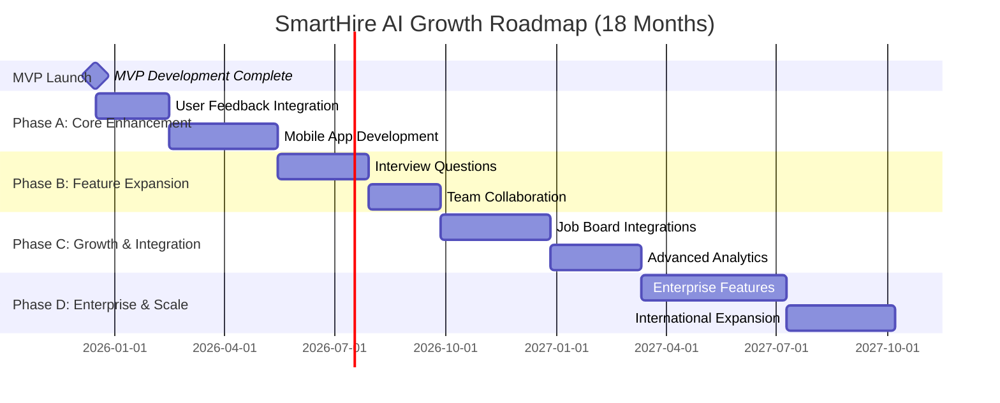

# SmartHire AI - Future Roadmap

**Document Type:** Post-MVP Feature Planning & Growth Strategy  
**Version:** 1.0  
**Owner:** John (Product Manager)  
**Status:** Draft  
**Created:** August 24, 2025  
**Horizon:** 18 months post-MVP launch

---

## 📋 Roadmap Philosophy

**Vision:** Build SmartHire AI into the recruitment platform of choice for growing businesses through strategic feature expansion, user-driven development, and sustainable scaling.

**Guiding Principles:**

1. **User-Driven Development:** Features prioritized by actual user feedback and usage data
2. **MVP-First Validation:** Every major feature starts with minimal implementation for validation
3. **Sustainable Growth:** Maintain cost efficiency and performance standards as we scale
4. **Mobile-First Evolution:** All new features designed for mobile-first user experience

---

## 🎯 Roadmap Overview

### Timeline & Phases

**Key Milestones:**

- **Month 2:** Mobile app beta launch
- **Month 6:** Interview questions feature launch
- **Month 9:** Team collaboration features
- **Month 12:** Enterprise-ready platform
- **Month 18:** International expansion complete

---

## 🚀 Phase A: Core Enhancement (Months 1-5)

### A1: User Feedback Integration (Months 1-2)

**Objective:** Optimize MVP based on real user behavior and feedback

#### Features & Improvements

**User Experience Optimization**

- **Enhanced Onboarding:** Interactive tutorial based on user drop-off points
- **Smarter Templates:** Job description templates based on popular user inputs
- **Improved AI Explanations:** Clearer reasoning based on user comprehension feedback
- **Performance Tuning:** Sub-20-second processing based on usage patterns

**Data-Driven Improvements**

- **Usage Analytics:** Understanding which features drive retention
- **AI Accuracy Tuning:** Improving match quality based on user feedback ratings
- **Cost Optimization:** Further reducing operational costs through usage pattern analysis

**Success Metrics:**

- **User Retention:** 75%+ month-over-month retention (up from 60% target)
- **Time-to-Value:** 90% of users complete first analysis within 10 minutes
- **AI Satisfaction:** 4.3/5.0 rating on match explanations (up from 4.0 target)

### A2: Native Mobile Applications (Months 3-5)

**Objective:** Deliver native mobile experience for primary user workflows

#### iOS & Android Apps (React Native)

**Core Mobile Features**

- **Native File Upload:** Camera integration for document scanning
- **Push Notifications:** Processing complete alerts and hiring reminders
- **Offline Review:** Downloaded candidate profiles accessible without internet
- **Voice Notes:** Voice-to-text for candidate feedback and notes

**Mobile-Optimized Workflows**

- **Swipe Interface:** Tinder-like candidate review with swipe gestures
- **Quick Actions:** One-tap decisions (Interested/Maybe/Pass) with haptic feedback
- **Share Integration:** Native sharing to email, messages, calendar apps
- **Biometric Security:** Touch/Face ID for secure app access

**Technical Considerations**

- **Development Time:** 12 weeks with React Native for cross-platform efficiency
- **Performance Target:** <3 second app launch, <1 second navigation
- **Offline Capability:** Core review workflows available without internet
- **Platform Guidelines:** Follow iOS HIG and Android Material Design

**Success Metrics:**

- **Mobile Adoption:** 40% of users try mobile app within 30 days
- **Mobile Retention:** 60% of mobile users remain active after 30 days
- **App Store Rating:** 4.2+ stars with positive reviews mentioning ease of use

---

## 💼 Phase B: Feature Expansion (Months 6-10)

### B1: Interview Question Generation (Months 6-8)

**Objective:** Extend AI capabilities to complete recruitment workflow

#### Smart Question Generation

**Role-Based Question Banks**

- **Technical Roles:** Programming challenges, system design, debugging scenarios
- **Business Roles:** Case studies, behavioral questions, culture fit assessments
- **Creative Roles:** Portfolio reviews, creative challenges, collaboration scenarios
- **Leadership Roles:** Management scenarios, strategic thinking, team building

**AI-Powered Customization**

- **CV-Specific Questions:** Tailored questions based on candidate background
- **Difficulty Scaling:** Adjustable complexity based on experience level
- **Interview Type:** Phone screen, technical interview, culture fit, final round
- **Bias Detection:** Flag potentially biased questions and suggest alternatives

**Delivery & Integration**

- **Mobile Export:** Send question sets via email or mobile sharing
- **Interview Templates:** Pre-built interview flows for common roles
- **Scoring Rubrics:** Suggested evaluation criteria for each question
- **Feedback Loop:** User ratings improve question quality over time

**Technical Implementation**

- **Processing Time:** <15 seconds for 10-question set generation
- **Question Quality:** 4.0+ rating from interviewers on relevance and clarity
- **Cost Target:** <$0.05 per question set generation

### B2: Team Collaboration Features (Months 8-10)

**Objective:** Enable hiring team collaboration and decision-making

#### Multi-User Workspaces

**Team Management**

- **Role-Based Permissions:** Admin, Interviewer, Reviewer roles with appropriate access
- **Candidate Sharing:** Share specific candidates with team members
- **Collaborative Notes:** Team members can add comments and feedback
- **Decision Tracking:** Track who made hiring decisions and when

**Workflow Features**

- **Interview Scheduling:** Calendar integration for interview coordination
- **Feedback Collection:** Structured feedback forms for each interviewer
- **Decision Workflows:** Approval processes for hiring recommendations
- **Communication:** In-app messaging for hiring discussions

**Team Analytics**

- **Hiring Funnel:** Track candidates through interview stages
- **Team Performance:** Interviewer effectiveness and bias analysis
- **Time-to-Hire:** Metrics on hiring process efficiency
- **Quality Tracking:** Correlation between AI recommendations and hiring outcomes

**Success Metrics:**

- **Team Adoption:** 30% of users invite team members within 60 days
- **Collaboration Usage:** 70% of teams use shared notes and feedback features
- **Hiring Efficiency:** 25% reduction in time-to-hire for collaborative teams

---

## 🌐 Phase C: Growth & Integration (Months 11-15)

### C1: Job Board Integrations (Months 11-13)

**Objective:** Streamline candidate sourcing and application management

#### Major Platform Integrations

**LinkedIn Talent Solutions**

- **Candidate Import:** Direct import of LinkedIn profiles for analysis
- **Job Posting Sync:** Automatically analyze applications from LinkedIn
- **Profile Enhancement:** Enrich CV data with LinkedIn professional information
- **Talent Pool Search:** Find candidates matching job requirements

**Indeed Integration**

- **Application Flow:** Direct analysis of Indeed applications
- **Job Posting Management:** Sync job descriptions with Indeed postings
- **Candidate Communication:** Streamlined messaging through Indeed platform
- **Analytics Integration:** Combine Indeed metrics with AI insights

**Additional Integrations**

- **AngelList:** Startup-focused candidate sourcing and analysis
- **Stack Overflow Jobs:** Technical talent sourcing for developer roles
- **Glassdoor:** Company review integration for candidate assessment
- **Email Integration:** Parse and analyze applications from email

**Technical Architecture**

- **API Integration:** RESTful APIs with rate limiting and error handling
- **Data Synchronization:** Real-time sync with webhook support
- **Privacy Compliance:** GDPR-compliant data handling across platforms
- **Cost Management:** Usage-based pricing with predictable costs

### C2: Advanced Analytics & Reporting (Months 13-15)

**Objective:** Provide data-driven insights for hiring optimization

#### Hiring Intelligence Dashboard

**Performance Analytics**

- **Hiring Funnel Analysis:** Conversion rates at each stage of hiring process
- **Source Quality:** Which sources produce the best hires
- **Time-to-Hire Metrics:** Average time from application to hire
- **Cost-per-Hire Analysis:** Total recruiting costs by role and source

**AI Performance Insights**

- **Prediction Accuracy:** How well AI recommendations correlate with actual hires
- **Bias Detection:** Analysis of hiring patterns for unconscious bias
- **Quality Improvement:** Continuous learning from hiring outcomes
- **A/B Testing:** Experiment with different AI models and prompts

**Team & Process Optimization**

- **Interviewer Effectiveness:** Feedback quality and decision accuracy by team member
- **Process Bottlenecks:** Identify stages where candidates drop off
- **Diversity Metrics:** Track diversity in hiring pipeline and outcomes
- **Benchmarking:** Compare hiring performance against industry standards

**Reporting & Exports**

- **Executive Dashboards:** High-level metrics for leadership review
- **Detailed Reports:** In-depth analysis for HR and recruiting teams
- **Automated Reports:** Scheduled delivery of key metrics
- **Data Export:** CSV/Excel export for external analysis

---

## 🏢 Phase D: Enterprise & Scale (Months 16-18)

### D1: Enterprise Features (Months 16-17)

**Objective:** Enable enterprise adoption with advanced security and customization

#### Enterprise Security & Compliance

**Authentication & Access Control**

- **Single Sign-On (SSO):** SAML 2.0 and OAuth integration
- **Multi-Factor Authentication:** Required 2FA/MFA for enterprise users
- **Advanced RLS:** Enterprise-grade row-level security with audit trails
- **API Security:** Rate limiting, API keys, webhook security

**Compliance Features**

- **Advanced GDPR:** Data processing agreements, right to portability
- **CCPA Compliance:** California consumer privacy act requirements
- **SOC 2 Type II:** Security and availability audit compliance
- **HIPAA Considerations:** Healthcare industry compliance where applicable

**Enterprise Administration**

- **User Management:** Bulk user import/export, automated provisioning
- **Advanced Permissions:** Fine-grained access control for different teams
- **Audit Logging:** Comprehensive logging of all user actions
- **Data Retention:** Configurable retention policies and automated cleanup

#### Customization & White-Label

**Custom AI Models**

- **Industry-Specific Training:** AI models trained on industry-specific data
- **Custom Scoring Criteria:** Configurable match algorithms
- **Bias Mitigation:** Custom bias detection and correction
- **Performance Tuning:** Enterprise-specific accuracy optimization

**White-Label Solution**

- **Custom Branding:** Complete UI customization with customer branding
- **Custom Domain:** Dedicated domain hosting for white-label customers
- **API-First Architecture:** Complete functionality available via API
- **Revenue Sharing:** Business model for recruitment agency partners

### D2: International Expansion (Month 18)

**Objective:** Support global hiring with localization and compliance

#### Multi-Language Support

**Localization Features**

- **UI Translation:** Support for 5 major languages (Spanish, French, German, Portuguese, Japanese)
- **Multi-Language CVs:** AI processing of non-English CVs and job descriptions
- **Cultural Adaptation:** Hiring practices adapted for different cultural contexts
- **Local Compliance:** GDPR, local privacy laws, employment regulations

**Global Infrastructure**

- **Regional Data Centers:** Data residency compliance for international customers
- **Multi-Currency Support:** Pricing and billing in local currencies
- **Regional Partnerships:** Local recruitment industry partnerships
- **Time Zone Support:** Business hours and support across time zones

---

## 📊 Success Metrics & Validation

### Growth Metrics (18-Month Targets)

**User Growth**

- **Registered Users:** 5,000+ businesses using the platform
- **Monthly Active Users:** 3,000+ (60% activation rate)
- **Enterprise Customers:** 50+ companies with 25+ employees
- **International Users:** 20% of user base outside North America

**Product Metrics**

- **Feature Adoption:** New features adopted by 60%+ of users within 30 days
- **Mobile Usage:** 50% of user sessions on mobile devices
- **Team Features:** 40% of customers use collaborative features
- **Integration Usage:** 25% of customers use job board integrations

**Business Metrics**

- **Revenue Growth:** $50K+ monthly recurring revenue
- **Customer Retention:** 80%+ annual retention rate
- **Cost Efficiency:** <$20/user/month operational costs at scale
- **Net Promoter Score:** 60+ NPS indicating strong customer satisfaction

### Validation Framework

**Feature Validation Process**

1. **User Research:** Interview 10+ users about feature need and design
2. **MVP Development:** Build minimal version for testing (2-4 weeks)
3. **Beta Testing:** 50+ beta users test feature for 2 weeks
4. **Success Criteria:** 60% adoption rate and 4.0+ satisfaction rating
5. **Full Development:** Complete feature development if validated

**Go/No-Go Criteria for Major Features**

- **User Demand:** 40%+ of surveyed users request the feature
- **Business Impact:** Feature contributes to retention or revenue growth
- **Technical Feasibility:** Can be built within resource constraints
- **Strategic Alignment:** Supports core value proposition and competitive advantage

---

## 🔄 Continuous Improvement Process

### User Feedback Integration

**Feedback Collection**

- **In-App Feedback:** Contextual feedback requests within workflows
- **User Interviews:** Monthly interviews with power users and recent churned users
- **Usage Analytics:** Data-driven insights into feature adoption and user behavior
- **Support Ticket Analysis:** Common issues and feature requests from support

**Feature Prioritization Framework**

1. **Impact Assessment:** Business impact (retention, revenue, growth)
2. **User Value:** Direct user value and satisfaction improvement
3. **Technical Effort:** Development complexity and resource requirements
4. **Strategic Alignment:** Alignment with long-term vision and competitive positioning

### Agile Development Process

**Sprint Structure**

- **2-Week Sprints:** Focused development cycles with clear deliverables
- **Quarterly Planning:** Major feature planning aligned with roadmap phases
- **Monthly Reviews:** Progress against roadmap with stakeholder input
- **Continuous Deployment:** Daily deployments with feature flagging

**Quality Assurance**

- **Automated Testing:** Comprehensive test suite for all new features
- **User Testing:** Beta testing for all major features before launch
- **Performance Monitoring:** Continuous monitoring of key performance metrics
- **Rollback Procedures:** Quick rollback capability for problematic releases

---

## 💡 Innovation & Research Areas

### Emerging Technology Integration

**Advanced AI Capabilities**

- **Computer Vision:** Automatic resume formatting analysis and red flag detection
- **Natural Language Processing:** Advanced sentiment analysis of candidate communications
- **Predictive Analytics:** Machine learning models for hiring success prediction
- **Conversational AI:** Chatbot for initial candidate screening

**Workflow Automation**

- **Smart Scheduling:** AI-powered interview scheduling optimization
- **Automated Outreach:** Personalized candidate communication automation
- **Reference Checking:** Automated reference verification and analysis
- **Onboarding Integration:** Seamless transition from hiring to employee onboarding

**Future Platform Features**

- **Video Interview Analysis:** AI-powered analysis of recorded video interviews
- **Skills Assessment Integration:** Technical assessments with automatic scoring
- **Background Check Automation:** Integrated background verification services
- **Diversity & Inclusion Tools:** Advanced bias detection and diversity tracking

### Market Research & Validation

**Ongoing Market Research**

- **Quarterly User Surveys:** Understanding evolving user needs and satisfaction
- **Competitive Analysis:** Regular assessment of competitive landscape changes
- **Industry Trend Monitoring:** Staying ahead of recruitment technology trends
- **Partnership Opportunities:** Identifying strategic integration and partnership opportunities

**Success Measurement**

- **Product-Market Fit:** Continuous assessment of user engagement and satisfaction
- **Market Position:** Market share analysis and competitive positioning
- **Growth Potential:** Assessment of addressable market expansion opportunities
- **Technology Trends:** Impact of AI and automation trends on recruitment industry

---

## 🔗 Resource Planning & Investment

### Development Resources by Phase

**Phase A (Months 1-5):** 1 Full-stack Developer + 0.5 Mobile Developer
**Phase B (Months 6-10):** 1.5 Full-stack Developers + 0.5 AI/ML Engineer  
**Phase C (Months 11-15):** 2 Full-stack Developers + 1 AI/ML Engineer + 0.5 DevOps
**Phase D (Months 16-18):** 2.5 Full-stack Developers + 1 AI/ML Engineer + 1 DevOps

### Investment Requirements

**Technology Infrastructure**

- **Months 1-6:** $500/month (basic scaling)
- **Months 7-12:** $2,000/month (enterprise features)
- **Months 13-18:** $5,000/month (global scaling)

**Development Team**

- **Year 1:** $400K (team scaling from 1 to 3 developers)
- **Year 2:** $600K (full enterprise development team)

**Market Expansion**

- **Marketing & Sales:** $100K (user acquisition and enterprise sales)
- **Legal & Compliance:** $50K (international expansion and enterprise compliance)
- **Partnerships & Integrations:** $25K (job board partnerships and API development)

---

## 📋 Risk Management & Contingencies

### Strategic Risks

**Market Risk: Competition from Enterprise Players**

- **Likelihood:** Medium-High
- **Impact:** High (market share and pricing pressure)
- **Mitigation:** Focus on SMB-specific features, superior UX, cost advantage

**Technology Risk: AI Cost Inflation**

- **Likelihood:** Medium
- **Impact:** Medium (business model sustainability)
- **Mitigation:** Multi-provider architecture, local processing capabilities, efficient prompting

**Execution Risk: Feature Development Delays**

- **Likelihood:** Medium
- **Impact:** Medium (competitive disadvantage, user disappointment)
- **Mitigation:** Agile development, MVP validation, realistic timeline planning

### Contingency Plans

**Scenario 1: Slow User Adoption**

- **Trigger:** <50% of projected user growth after 6 months
- **Response:** Pivot to enterprise focus, increase marketing spend, product positioning review

**Scenario 2: Technical Performance Issues**

- **Trigger:** Unable to maintain performance standards with user growth
- **Response:** Architecture redesign, additional infrastructure investment, feature simplification

**Scenario 3: Competitive Pressure**

- **Trigger:** Major competitor launches similar product with significant advantages
- **Response:** Accelerate roadmap, focus on differentiation, consider strategic partnerships

---

This roadmap provides a comprehensive path for SmartHire AI's evolution from MVP to market-leading recruitment platform. Success depends on disciplined execution, user-focused development, and maintaining the core competitive advantages of speed, transparency, and cost efficiency that differentiate us in the market.

**Next Steps:** Validate roadmap priorities with key stakeholders, finalize resource requirements, and establish success metrics tracking for post-MVP development.
