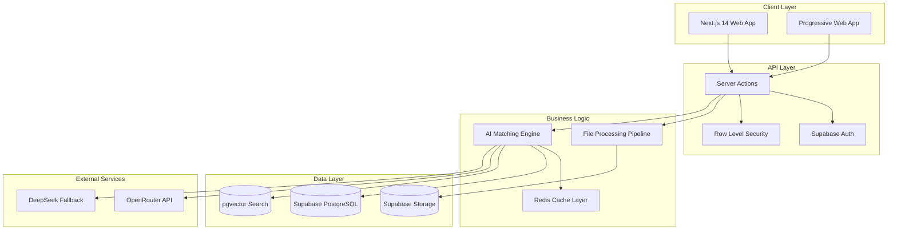

# SmartHire AI - Technical Design Document

**Document Type:** Technical Architecture & Implementation Specification  
**Version:** 1.0  
**Owner:** Winston (Technical Architect)  
**Status:** Draft  
**Created:** August 24, 2025  
**Related PRD:** [SmartHire AI MVP PRD](smarthire_mvp_prd.md)

---

## 📋 Document Purpose & Scope

**Objective:** Define HOW we'll build the SmartHire AI MVP with focus on the 30-second processing guarantee and sustainable cost structure.

**Audience:** Engineering team, DevOps, Technical stakeholders  
**Scope:** Complete technical specification for MVP features only
**Key Constraints:** 
- Must achieve <30 second processing SLA
- Must operate within $8/month cost budget for 100+ users
- Web-first, mobile-optimized (not native mobile apps)

---

## 🏗️ System Architecture Overview

### High-Level Architecture



### Technology Stack Rationale

**Frontend Framework: Next.js 14 with App Router**
- **Reasoning:** Server Actions provide secure, CSRF-protected API endpoints
- **Benefits:** Type-safe client-server communication, excellent performance, SEO capabilities
- **Trade-offs:** Learning curve for team, but superior DX and performance

**Database: Supabase (PostgreSQL + pgvector)**
- **Reasoning:** Generous free tier (500MB DB, 50K auth users), built-in auth and RLS
- **Benefits:** Vector search capabilities, real-time subscriptions, automatic backups
- **Trade-offs:** Vendor lock-in, but migration path exists via PostgreSQL compatibility

**AI Provider: OpenRouter with DeepSeek fallback**  
- **Reasoning:** Cost optimization through model selection, 300+ models available
- **Benefits:** $0.003-0.01 per 1K tokens, automatic failover capabilities
- **Trade-offs:** Additional complexity, but critical for cost management

---

## ⚡ 30-Second Processing Architecture

### Performance Critical Path Analysis

**Target Breakdown:**
- File upload & parsing: <8 seconds
- AI processing (batch): <18 seconds  
- Result formatting & storage: <4 seconds
- **Total: <30 seconds for up to 20 CVs**

### Parallel Processing Pipeline

```typescript
// Core processing pipeline for 30-second guarantee
export async function processCVBatch(
  cvFiles: File[], 
  jobDescription: string
): Promise<MatchResult[]> {
  
  // Phase 1: Parallel file parsing (target: <8s)
  const parsedCVs = await Promise.all(
    cvFiles.map(file => parseFileInParallel(file))
  );
  
  // Phase 2: Batch AI processing (target: <18s)
  const aiPrompt = createBatchPrompt(parsedCVs, jobDescription);
  const aiResults = await processWithFallback(aiPrompt);
  
  // Phase 3: Result processing (target: <4s)
  const matches = await Promise.all([
    formatResults(aiResults),
    storeResults(aiResults),
    cacheResults(aiResults)
  ]);
  
  return matches;
}
```

### File Processing Optimization

**Parallel Parser Architecture:**
```typescript
async function parseFileInParallel(file: File): Promise<ParsedCV> {
  const fileType = file.type;
  
  // Route to appropriate parser based on file type
  switch (fileType) {
    case 'application/pdf':
      return await parsePDF(file);
    case 'application/msword':
    case 'application/vnd.openxmlformats-officedocument.wordprocessingml.document':
      return await parseWord(file);
    default:
      return await parseWithOCR(file); // Fallback for images/scanned docs
  }
}
```

### AI Processing with Intelligent Caching

**Cache Strategy (90% hit rate target):**
- **Key:** Hash of (CV content + Job description)
- **TTL:** 24 hours (hiring decisions are time-sensitive)
- **Storage:** Redis with 10MB limit per result set

```typescript
async function processWithCaching(cvContent: string, jd: string): Promise<MatchResult> {
  const cacheKey = generateCacheKey(cvContent, jd);
  
  // Check cache first
  const cached = await redis.get(cacheKey);
  if (cached) return JSON.parse(cached);
  
  // Process with AI if not cached
  const result = await processWithAI(cvContent, jd);
  
  // Cache result for future use
  await redis.setex(cacheKey, 86400, JSON.stringify(result));
  
  return result;
}
```

---

## 🤖 AI Integration Architecture

### Model Selection & Cost Optimization

**Primary Model: Claude 3.5 Haiku via OpenRouter**
- **Cost:** ~$0.0025 per analysis (including input/output)
- **Performance:** ~3-5 seconds per CV analysis
- **Quality:** Excellent reasoning capabilities for explainable results

**Fallback Model: DeepSeek-R1**  
- **Cost:** ~$0.0008 per analysis (ultra-low cost)
- **Performance:** ~2-3 seconds per CV analysis
- **Use Case:** When primary model fails or cost limits approached

### AI Prompt Engineering

**Optimized Batch Processing Prompt:**
```typescript
const BATCH_ANALYSIS_PROMPT = `
Analyze these CVs against the job requirements and return structured JSON:

JOB DESCRIPTION:
${jobDescription}

CVs TO ANALYZE:
${cvs.map((cv, i) => `CV ${i+1}:\n${cv.content}`).join('\n\n')}

Return JSON array with this exact structure for each CV:
{
  "cv_index": number,
  "match_percentage": number (0-100),
  "confidence": number (0-1),
  "matching_skills": string[],
  "missing_skills": string[],
  "strengths": string[],
  "concerns": string[],
  "recommendation": "strong_match" | "potential_fit" | "not_recommended",
  "reasoning": "Detailed explanation of the score and recommendation"
}

Focus on: technical skills, experience level, role fit, red flags.
Be concise but specific in reasoning.
`;
```

### Error Handling & Fallbacks

**Multi-Layer Fallback Strategy:**
1. **Primary:** OpenRouter with Claude 3.5 Haiku
2. **Secondary:** OpenRouter with DeepSeek-R1 (cost optimization)
3. **Tertiary:** Local keyword matching (basic functionality)
4. **Quaternary:** Graceful degradation with user notification

```typescript
async function processWithFallback(prompt: string): Promise<AIResult> {
  try {
    // Try primary provider
    return await openRouter.process(prompt, 'anthropic/claude-3.5-haiku');
  } catch (error) {
    try {
      // Fallback to cost-optimized model
      return await openRouter.process(prompt, 'deepseek/deepseek-r1');
    } catch (fallbackError) {
      // Final fallback to keyword matching
      return await localKeywordMatching(prompt);
    }
  }
}
```

---

## 🗄️ Database Schema & Architecture

### Core Database Schema

```sql
-- Enhanced schema optimized for performance and cost
CREATE TABLE users (
    id UUID PRIMARY KEY DEFAULT gen_random_uuid(),
    email VARCHAR(255) UNIQUE NOT NULL,
    full_name VARCHAR(255),
    company VARCHAR(255),
    
    -- MVP-focused fields
    subscription_tier VARCHAR(20) DEFAULT 'free',
    monthly_usage_count INTEGER DEFAULT 0,
    usage_reset_date DATE DEFAULT CURRENT_DATE,
    
    -- Preferences
    preferred_analysis_depth VARCHAR(20) DEFAULT 'standard',
    
    created_at TIMESTAMP DEFAULT CURRENT_TIMESTAMP,
    updated_at TIMESTAMP DEFAULT CURRENT_TIMESTAMP
);

CREATE TABLE job_descriptions (
    id UUID PRIMARY KEY DEFAULT gen_random_uuid(),
    user_id UUID REFERENCES users(id) ON DELETE CASCADE,
    title VARCHAR(255) NOT NULL,
    company VARCHAR(255),
    description TEXT NOT NULL,
    requirements TEXT NOT NULL,
    
    -- AI optimization fields
    description_embedding vector(1536), -- For semantic search
    key_skills TEXT[] DEFAULT '{}',
    experience_level VARCHAR(20), -- 'junior', 'mid', 'senior'
    
    -- Usage tracking
    times_used INTEGER DEFAULT 0,
    last_used_at TIMESTAMP,
    
    created_at TIMESTAMP DEFAULT CURRENT_TIMESTAMP,
    updated_at TIMESTAMP DEFAULT CURRENT_TIMESTAMP
);

CREATE TABLE candidates (
    id UUID PRIMARY KEY DEFAULT gen_random_uuid(),
    user_id UUID REFERENCES users(id) ON DELETE CASCADE,
    
    -- Basic info (extracted from CV)
    full_name VARCHAR(255) NOT NULL,
    email VARCHAR(255),
    phone VARCHAR(50),
    
    -- CV content and metadata
    original_filename VARCHAR(255) NOT NULL,
    cv_text TEXT NOT NULL,
    cv_summary TEXT, -- AI-generated summary
    extracted_skills TEXT[] DEFAULT '{}',
    
    -- AI processing fields  
    cv_embedding vector(1536), -- For semantic similarity
    experience_level VARCHAR(20),
    
    -- File management
    file_url TEXT NOT NULL,
    file_type VARCHAR(10) NOT NULL,
    file_size_bytes INTEGER,
    
    -- Lifecycle management
    processed_at TIMESTAMP DEFAULT CURRENT_TIMESTAMP,
    expires_at TIMESTAMP DEFAULT (CURRENT_TIMESTAMP + INTERVAL '90 days'),
    
    created_at TIMESTAMP DEFAULT CURRENT_TIMESTAMP
);

CREATE TABLE cv_jd_matches (
    id UUID PRIMARY KEY DEFAULT gen_random_uuid(),
    user_id UUID REFERENCES users(id) ON DELETE CASCADE,
    candidate_id UUID REFERENCES candidates(id) ON DELETE CASCADE,
    job_description_id UUID REFERENCES job_descriptions(id) ON DELETE CASCADE,
    
    -- Core matching results
    match_percentage DECIMAL(5,2) NOT NULL,
    confidence_score DECIMAL(3,2) NOT NULL,
    processing_time_ms INTEGER NOT NULL,
    
    -- Structured AI analysis
    matching_skills TEXT[],
    missing_skills TEXT[],
    strengths TEXT[],
    concerns TEXT[],
    recommendation VARCHAR(20) NOT NULL, -- 'strong_match', 'potential_fit', 'not_recommended'
    ai_reasoning TEXT NOT NULL,
    
    -- User feedback (for continuous improvement)
    user_rating INTEGER, -- 1-5 scale
    user_feedback TEXT,
    user_decision VARCHAR(20), -- 'interview', 'maybe', 'pass'
    
    -- Cost tracking
    ai_provider VARCHAR(50),
    processing_cost_usd DECIMAL(8,4) DEFAULT 0.0000,
    
    created_at TIMESTAMP DEFAULT CURRENT_TIMESTAMP
);

-- Performance indexes for MVP scale
CREATE INDEX idx_candidates_user_embedding ON candidates USING ivfflat (cv_embedding vector_cosine_ops);
CREATE INDEX idx_jd_user_embedding ON job_descriptions USING ivfflat (description_embedding vector_cosine_ops);
CREATE INDEX idx_matches_user_created ON cv_jd_matches(user_id, created_at DESC);
CREATE INDEX idx_candidates_expires ON candidates(expires_at) WHERE expires_at IS NOT NULL;

-- Row Level Security for multi-tenant data isolation
ALTER TABLE users ENABLE ROW LEVEL SECURITY;
ALTER TABLE candidates ENABLE ROW LEVEL SECURITY;
ALTER TABLE job_descriptions ENABLE ROW LEVEL SECURITY;
ALTER TABLE cv_jd_matches ENABLE ROW LEVEL SECURITY;

-- RLS Policies
CREATE POLICY "Users can only see own data" ON candidates
    FOR ALL USING (auth.uid() = user_id);

CREATE POLICY "Users can only see own matches" ON cv_jd_matches  
    FOR ALL USING (auth.uid() = user_id);
```

### Data Retention & Cost Management

**Automated Cleanup Strategy:**
```sql
-- Daily cleanup job to manage storage costs
CREATE OR REPLACE FUNCTION cleanup_expired_data() RETURNS void AS $$
BEGIN
    -- Delete expired candidate files from storage
    DELETE FROM candidates WHERE expires_at < CURRENT_TIMESTAMP;
    
    -- Clean up orphaned match records
    DELETE FROM cv_jd_matches 
    WHERE candidate_id NOT IN (SELECT id FROM candidates);
    
    -- Reset monthly usage counters
    UPDATE users 
    SET monthly_usage_count = 0, usage_reset_date = CURRENT_DATE 
    WHERE usage_reset_date < CURRENT_DATE - INTERVAL '30 days';
    
END;
$$ LANGUAGE plpgsql;

-- Schedule daily cleanup
SELECT cron.schedule('cleanup-expired-data', '0 2 * * *', 'SELECT cleanup_expired_data();');
```

---

## 🔒 Security & Privacy Architecture

### Authentication & Authorization

**Supabase Auth Integration:**
```typescript
// Client-side auth handling
export const supabase = createClient(
  process.env.NEXT_PUBLIC_SUPABASE_URL!,
  process.env.NEXT_PUBLIC_SUPABASE_ANON_KEY!
);

// Server Action with RLS enforcement
export async function uploadCV(formData: FormData) {
  // Verify user authentication
  const { data: { user }, error } = await supabase.auth.getUser();
  if (error || !user) throw new Error('Unauthorized');
  
  // RLS will automatically filter data by user_id
  const { data, error: dbError } = await supabase
    .from('candidates')
    .insert({ user_id: user.id, ...candidateData });
    
  return data;
}
```

### Data Privacy & GDPR Compliance

**Privacy by Design Implementation:**
```typescript
// Automatic data encryption for sensitive fields
export async function storeCandidateData(data: CandidateData) {
  const encrypted = {
    ...data,
    email: encrypt(data.email),
    phone: encrypt(data.phone),
    cv_text: encrypt(data.cv_text)
  };
  
  return await supabase.from('candidates').insert(encrypted);
}

// GDPR deletion handler  
export async function deleteUserData(userId: string) {
  // Delete from all tables with cascade
  await supabase.from('users').delete().eq('id', userId);
  
  // Remove files from storage
  await supabase.storage.from('cvs').remove([`${userId}/*`]);
  
  // Clear cache
  await redis.del(`user:${userId}:*`);
}
```

### File Security

**Secure File Upload Pipeline:**
```typescript
export async function secureFileUpload(file: File, userId: string): Promise<string> {
  // Validate file type and size
  if (!ALLOWED_FILE_TYPES.includes(file.type)) {
    throw new Error('Unsupported file type');
  }
  if (file.size > MAX_FILE_SIZE) {
    throw new Error('File too large');
  }
  
  // Virus scanning (basic implementation)
  await scanFileForThreats(file);
  
  // Generate secure filename
  const filename = `${userId}/${uuid()}-${sanitizeFilename(file.name)}`;
  
  // Upload to secure storage
  const { data, error } = await supabase.storage
    .from('cvs')
    .upload(filename, file, {
      cacheControl: '3600',
      upsert: false
    });
    
  if (error) throw error;
  return data.path;
}
```

---

## 📱 Mobile-Optimized Web Architecture

### Progressive Web App (PWA) Implementation

**PWA Configuration:**
```typescript
// next.config.js - PWA setup
const withPWA = require('next-pwa')({
  dest: 'public',
  register: true,
  skipWaiting: true,
  disable: process.env.NODE_ENV === 'development'
});

module.exports = withPWA({
  // Next.js config
  experimental: {
    appDir: true,
    serverActions: true
  }
});
```

**Mobile-First Component Architecture:**
```typescript
// Mobile-optimized file upload component
export function MobileFileUpload() {
  return (
    <div className="touch-friendly">
      {/* Large touch targets (44px minimum) */}
      <button 
        className="min-h-[44px] min-w-[44px] p-4 rounded-lg bg-blue-600"
        onClick={handleFileSelect}
      >
        Upload CVs
      </button>
      
      {/* Drag and drop with touch support */}
      <div 
        className="border-dashed border-2 p-8 rounded-lg"
        onDrop={handleDrop}
        onTouchEnd={handleTouchDrop}
      >
        Drop files here or tap to select
      </div>
    </div>
  );
}
```

### Responsive UI Patterns

**Mobile-Optimized Match Results:**
```typescript
export function MatchResultsMobile({ matches }: { matches: MatchResult[] }) {
  return (
    <div className="space-y-4">
      {matches.map(match => (
        <div key={match.id} className="bg-white rounded-lg shadow-sm border p-4">
          {/* Header with score - always visible */}
          <div className="flex justify-between items-center mb-3">
            <h3 className="font-semibold text-lg truncate">{match.name}</h3>
            <ScoreBadge score={match.percentage} />
          </div>
          
          {/* Collapsible details for mobile */}
          <Disclosure>
            <Disclosure.Button className="w-full text-left">
              <div className="flex justify-between items-center">
                <span className="text-sm text-gray-600">View Details</span>
                <ChevronDownIcon className="w-4 h-4" />
              </div>
            </Disclosure.Button>
            
            <Disclosure.Panel className="mt-3 pt-3 border-t">
              <MatchDetails match={match} />
            </Disclosure.Panel>
          </Disclosure>
          
          {/* Quick action buttons - touch friendly */}
          <div className="flex gap-2 mt-4">
            <ActionButton 
              variant="primary" 
              className="flex-1 min-h-[44px]"
              onClick={() => handleInterested(match.id)}
            >
              Interested
            </ActionButton>
            <ActionButton 
              variant="secondary" 
              className="flex-1 min-h-[44px]"
              onClick={() => handlePass(match.id)}
            >
              Pass
            </ActionButton>
          </div>
        </div>
      ))}
    </div>
  );
}
```

---

## ⚖️ Performance & Scalability

### Performance Monitoring

**Core Web Vitals Optimization:**
```typescript
// Performance monitoring with Vercel Analytics
import { Analytics } from '@vercel/analytics/react';
import { SpeedInsights } from '@vercel/speed-insights/next';

export default function RootLayout({ children }: { children: React.ReactNode }) {
  return (
    <html>
      <body>
        {children}
        <Analytics />
        <SpeedInsights />
      </body>
    </html>
  );
}
```

**Real-time Performance Tracking:**
```typescript
// Custom performance monitoring
export async function trackProcessingTime(operation: string, fn: () => Promise<any>) {
  const start = Date.now();
  
  try {
    const result = await fn();
    const duration = Date.now() - start;
    
    // Track successful operations
    await supabase.from('performance_metrics').insert({
      operation,
      duration_ms: duration,
      success: true,
      timestamp: new Date().toISOString()
    });
    
    return result;
  } catch (error) {
    const duration = Date.now() - start;
    
    // Track failed operations
    await supabase.from('performance_metrics').insert({
      operation,
      duration_ms: duration,
      success: false,
      error_message: error.message,
      timestamp: new Date().toISOString()
    });
    
    throw error;
  }
}
```

### Scalability Architecture

**Database Scaling Strategy:**
- **Current:** Single Supabase instance (sufficient for 100-500 users)
- **Next Phase:** Read replicas for query optimization (1000+ users)
- **Future:** Database sharding by user segments (5000+ users)

**API Scaling Plan:**
- **Current:** Serverless functions with 60s timeout
- **Next Phase:** Background job processing for large batches
- **Future:** Microservices architecture with dedicated AI processing nodes

### Cost Optimization Strategies

**Intelligent Resource Management:**
```typescript
// Dynamic cost management
export class CostManager {
  private monthlyBudget = 800; // $8 * 100 users
  private currentSpend = 0;
  
  async checkBudgetBefore(operation: string, estimatedCost: number): Promise<boolean> {
    const remaining = this.monthlyBudget - this.currentSpend;
    
    if (estimatedCost > remaining) {
      // Trigger cost-saving measures
      await this.activateFallbackMode();
      return false;
    }
    
    return true;
  }
  
  async activateFallbackMode() {
    // Switch to cheaper AI models
    // Increase cache TTL
    // Reduce AI prompt complexity
    // Notify admin of budget limits
  }
}
```

---

## 🚀 Deployment & DevOps

### CI/CD Pipeline

**GitHub Actions Workflow:**
```yaml
# .github/workflows/deploy.yml
name: Deploy to Production

on:
  push:
    branches: [main]

jobs:
  test:
    runs-on: ubuntu-latest
    steps:
      - uses: actions/checkout@v4
      - uses: actions/setup-node@v4
        with:
          node-version: '18'
          cache: 'npm'
      
      - run: npm ci
      - run: npm run test
      - run: npm run test:e2e
      
  deploy:
    needs: test
    runs-on: ubuntu-latest
    steps:
      - uses: actions/checkout@v4
      - uses: actions/setup-node@v4
        with:
          node-version: '18'
          cache: 'npm'
      
      - run: npm ci
      - run: npm run build
      
      - name: Deploy to Vercel
        uses: amondnet/vercel-action@v25
        with:
          vercel-token: ${{ secrets.VERCEL_TOKEN }}
          vercel-org-id: ${{ secrets.VERCEL_ORG_ID }}
          vercel-project-id: ${{ secrets.VERCEL_PROJECT_ID }}
          vercel-args: '--prod'
```

### Environment Configuration

**Production Environment Setup:**
```bash
# Environment variables for production
NEXT_PUBLIC_SUPABASE_URL=https://your-project.supabase.co
NEXT_PUBLIC_SUPABASE_ANON_KEY=your-anon-key
SUPABASE_SERVICE_ROLE_KEY=your-service-role-key

OPENROUTER_API_KEY=your-openrouter-key
DEEPSEEK_API_KEY=your-deepseek-fallback-key

UPSTASH_REDIS_REST_URL=your-redis-url
UPSTASH_REDIS_REST_TOKEN=your-redis-token

# Security
NEXTAUTH_SECRET=your-nextauth-secret
NEXTAUTH_URL=https://your-domain.com

# Monitoring
VERCEL_ANALYTICS_ID=your-analytics-id
SENTRY_DSN=your-sentry-dsn
```

### Monitoring & Alerting

**Comprehensive Monitoring Setup:**
```typescript
// Monitoring configuration
export const monitoring = {
  // Performance monitoring
  sla: {
    processingTime: 30000, // 30 seconds
    uptime: 0.99, // 99%
    errorRate: 0.05 // 5%
  },
  
  // Cost monitoring  
  budget: {
    monthly: 800, // $8 per 100 users
    alertThreshold: 0.8, // Alert at 80%
    cutoffThreshold: 0.95 // Hard limit at 95%
  },
  
  // Alerting channels
  alerts: {
    slack: process.env.SLACK_WEBHOOK_URL,
    email: process.env.ADMIN_EMAIL,
    pagerduty: process.env.PAGERDUTY_KEY
  }
};
```

---

## 🔧 Development Guidelines

### Code Structure & Patterns

**Recommended Project Structure:**
```
src/
├── app/                    # Next.js 14 App Router
│   ├── (auth)/            # Auth-protected routes
│   ├── api/               # API routes (minimal, prefer Server Actions)
│   ├── globals.css        # Global styles
│   └── layout.tsx         # Root layout
├── components/            # Reusable UI components
│   ├── ui/                # shadcn/ui components
│   ├── forms/             # Form components
│   └── layout/            # Layout components  
├── lib/                   # Utility libraries
│   ├── ai/                # AI processing logic
│   ├── database/          # Database utilities
│   ├── auth/              # Auth helpers
│   └── utils.ts           # General utilities
├── types/                 # TypeScript type definitions
└── hooks/                 # Custom React hooks
```

### Code Quality Standards

**TypeScript Configuration:**
```json
// tsconfig.json
{
  "compilerOptions": {
    "target": "es5",
    "lib": ["dom", "dom.iterable", "es6"],
    "allowJs": true,
    "skipLibCheck": true,
    "strict": true,
    "forceConsistentCasingInFileNames": true,
    "noEmit": true,
    "esModuleInterop": true,
    "module": "esnext",
    "moduleResolution": "bundler",
    "resolveJsonModule": true,
    "isolatedModules": true,
    "jsx": "preserve",
    "incremental": true,
    "plugins": [{ "name": "next" }],
    "baseUrl": ".",
    "paths": {
      "@/*": ["./src/*"]
    }
  },
  "include": ["next-env.d.ts", "**/*.ts", "**/*.tsx", ".next/types/**/*.ts"],
  "exclude": ["node_modules"]
}
```

### Testing Strategy

**Test Coverage Requirements:**
- **Unit Tests:** >80% coverage for business logic
- **Integration Tests:** All API endpoints and database operations  
- **E2E Tests:** Critical user workflows (upload → process → results)
- **Performance Tests:** 30-second SLA validation

```typescript
// Example test for critical processing function
import { processCVBatch } from '@/lib/ai/processing';

describe('CV Batch Processing', () => {
  test('should complete within 30 seconds', async () => {
    const start = Date.now();
    const mockCVs = generateMockCVs(10);
    const mockJD = generateMockJobDescription();
    
    const results = await processCVBatch(mockCVs, mockJD);
    const duration = Date.now() - start;
    
    expect(duration).toBeLessThan(30000);
    expect(results).toHaveLength(10);
    expect(results[0]).toHaveProperty('match_percentage');
  });
});
```

---

## 📋 Implementation Checklist

### Phase 1: Foundation (Weeks 1-4)
- [ ] Next.js 14 project setup with TypeScript
- [ ] Supabase integration (database, auth, storage)
- [ ] Basic UI components with shadcn/ui
- [ ] File upload functionality with validation
- [ ] User authentication and profile management

### Phase 2: Core Processing (Weeks 5-8)  
- [ ] PDF/Word/OCR file parsing pipeline
- [ ] OpenRouter AI integration with fallbacks
- [ ] Redis caching implementation
- [ ] Parallel processing for 30-second SLA
- [ ] Basic match results display

### Phase 3: Polish & Performance (Weeks 9-12)
- [ ] Mobile-responsive UI optimization  
- [ ] Performance monitoring and alerting
- [ ] Error handling and user feedback
- [ ] GDPR compliance features
- [ ] Production deployment and testing

### Phase 4: Launch Preparation (Weeks 13-16)
- [ ] Load testing and performance validation
- [ ] Security audit and penetration testing
- [ ] User acceptance testing with beta users
- [ ] Documentation and support materials
- [ ] Production launch with monitoring

---

## 🔗 Related Documentation

- **[MVP Product Requirements](smarthire_mvp_prd.md)** - Business requirements and user stories
- **[Implementation Plan](smarthire_implementation_plan.md)** - Timeline and resource planning
- **[API Documentation](smarthire_api_docs.md)** - Detailed API specifications *(to be created)*
- **[Deployment Guide](smarthire_deployment.md)** - Infrastructure setup and deployment *(to be created)*

---

*This technical design provides the complete implementation blueprint for the SmartHire AI MVP. All architectural decisions are optimized for the 30-second processing SLA and $8/month cost target while maintaining high code quality and user experience standards.*

**Next Steps:** Review with engineering team, validate 30-second SLA through prototyping, finalize implementation timeline.