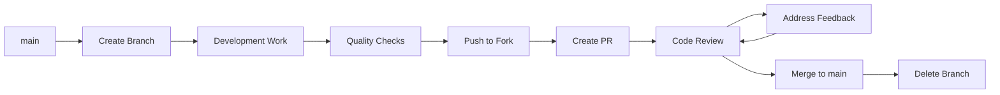

# Development Workflow Guide

## Overview

This guide outlines the daily development workflow for SmartHire AI contributors. Follow these procedures to ensure consistent, high-quality development practices.

---

## Daily Development Workflow

### 1. Start Your Development Day

**Sync with Latest Changes:**

```bash
# Switch to main branch
git checkout main

# Pull latest changes from upstream
git pull upstream main

# Push updates to your fork
git push origin main
```

**Update Dependencies (if needed):**

```bash
# Check for updates
npm outdated

# Update dependencies if necessary
npm update

# Verify everything works
npm run quality
```

### 2. Pick Up New Work

**Review Available Tasks:**

- Check [IMPROVEMENT-TASK-TRACKING.md](../IMPROVEMENT-TASK-TRACKING.md) for assigned tasks
- Review GitHub Issues for bug reports or feature requests
- Coordinate with team on Slack/Discord for task assignment

**Create Feature Branch:**

```bash
# For Epic tasks (E14-TX format)
git checkout -b dev-e14-t6-documentation-dev-environment

# For general features
git checkout -b feature/user-profile-enhancements

# For bug fixes
git checkout -b fix/mobile-responsive-layout
```

### 3. Development Process

**Start Development Server:**

```bash
npm run dev
```

**Make Changes:**

- Follow [project structure guidelines](project-structure.md)
- Implement features incrementally
- Test changes frequently in the browser
- Write unit tests as you develop

**Quality Checks During Development:**

```bash
# Run individual checks as needed
npm run type-check    # TypeScript validation
npm run lint          # Code quality checks
npm test -- --watch  # Run tests in watch mode
```

### 4. Commit Your Changes

**Stage Changes:**

```bash
# Stage specific files
git add src/components/ui/button.tsx
git add src/components/ui/__tests__/button.test.tsx

# Or stage all changes (be careful!)
git add .
```

**Commit with Conventional Format:**

```bash
git commit -m "feat(ui): add button component with variants

- Add primary, secondary, and destructive variants
- Include size options (sm, md, lg)
- Add comprehensive test coverage
- Update component documentation"
```

**Pre-commit Hooks Verification:**

- Husky automatically runs quality checks
- Fix any issues that arise before commit completes
- Hooks run: ESLint, Prettier, TypeScript, Tests

### 5. Push and Create Pull Request

**Push to Your Fork:**

```bash
git push origin feature-branch-name
```

**Create Pull Request:**

1. Visit GitHub repository
2. Click "New Pull Request"
3. Select your branch
4. Fill out PR template (see below)
5. Request review from team members

---

## Branch Strategy

### Branch Types

**Epic Tasks (E14-TX format):**

```bash
dev-e14-t1-nextjs-foundation-setup
dev-e14-t6-documentation-dev-environment
dev-e15-t2-ai-processing-pipeline
```

**Feature Development:**

```bash
feature/user-authentication
feature/cv-upload-processing
feature/dashboard-analytics
```

**Bug Fixes:**

```bash
fix/mobile-responsive-layout
fix/authentication-token-refresh
fix/file-upload-validation
```

**Documentation:**

```bash
docs/api-documentation-update
docs/contributing-guidelines
docs/deployment-procedures
```

**Chores/Maintenance:**

```bash
chore/dependency-updates
chore/eslint-configuration
chore/test-setup-improvements
```

### Branch Lifecycle



---

## Commit Message Guidelines

### Conventional Commit Format

```
type(scope): subject

[optional body]

[optional footer(s)]
```

### Commit Types

- **feat**: New feature for the user
- **fix**: Bug fix for the user
- **docs**: Documentation changes
- **style**: Code style changes (formatting, semicolons, etc.)
- **refactor**: Code refactoring (no new features or bug fixes)
- **test**: Adding or updating tests
- **chore**: Maintenance tasks (dependencies, build process, etc.)

### Scope Examples

- **ui**: User interface components
- **auth**: Authentication system
- **db**: Database operations
- **api**: API endpoints
- **docs**: Documentation
- **config**: Configuration files
- **test**: Test utilities

### Good Commit Examples

```bash
# Feature commits
feat(auth): implement enhanced signup validation
feat(ui): add responsive dashboard layout
feat(api): add CV processing endpoint

# Bug fix commits
fix(ui): resolve mobile navigation menu overflow
fix(auth): handle token refresh edge cases
fix(db): prevent duplicate user registration

# Documentation commits
docs(readme): update installation instructions
docs(api): add endpoint documentation
docs(contrib): clarify testing requirements

# Refactoring commits
refactor(db): optimize user query performance
refactor(ui): extract common form components
refactor(auth): simplify authentication flow

# Test commits
test(auth): add signup form validation tests
test(ui): improve button component coverage
test(api): add endpoint integration tests
```

### Bad Commit Examples

```bash
# ❌ Too vague
"fix stuff"
"update code"
"changes"

# ❌ No type or scope
"add new button"
"fixed bug"
"updated docs"

# ❌ Too detailed in subject
"feat(ui): add new button component with primary secondary and destructive variants plus size options"

# ❌ Wrong type usage
"feat(fix): resolve authentication issue"
```

---

## Code Review Process

### Submitting Pull Requests

**PR Title Format:**

```
type(scope): Brief description of changes
```

**PR Description Template:**

```markdown
## Summary

Brief description of what this PR accomplishes.

## Type of Change

- [ ] Bug fix (non-breaking change that fixes an issue)
- [ ] New feature (non-breaking change that adds functionality)
- [ ] Breaking change (fix or feature that causes existing functionality to change)
- [ ] Documentation update
- [ ] Code refactoring
- [ ] Performance improvement

## Changes Made

- Specific change 1
- Specific change 2
- Specific change 3

## Testing

- [ ] All quality gates pass (`npm run quality`)
- [ ] New tests added for new functionality
- [ ] All existing tests pass
- [ ] Manual testing completed
- [ ] Cross-browser testing (if applicable)
- [ ] Mobile testing (if applicable)

## Screenshots (if applicable)

[Add screenshots of UI changes]

## Quality Checklist

- [ ] Code follows style guidelines
- [ ] Self-review completed
- [ ] Hard-to-understand areas commented
- [ ] Documentation updated if needed
- [ ] No console.log statements left in code
- [ ] Error handling implemented where needed

## Related Issues

Closes #123
Relates to #456
```

### Review Guidelines for Reviewers

**Review Focus Areas:**

1. **Functionality**: Does the code work as intended?
2. **Quality**: Is the code well-structured and maintainable?
3. **Testing**: Are there adequate tests for new functionality?
4. **Performance**: Are there any performance concerns?
5. **Security**: Are there any security vulnerabilities?
6. **Accessibility**: Does UI code meet accessibility standards?

**Review Comments:**

```markdown
# ✅ Good review comments

"Consider extracting this logic into a separate utility function for reusability."
"This component looks great! Could we add a test for the error state?"
"The implementation is solid. Just a minor suggestion about variable naming."

# ❌ Poor review comments

"This is wrong."
"Fix this."
"Looks good."
```

### Addressing Review Feedback

**Responding to Comments:**

1. Read all feedback carefully
2. Ask for clarification if comments are unclear
3. Make requested changes in separate commits
4. Reply to comments explaining your changes
5. Re-request review when ready

**Making Changes:**

```bash
# Make changes based on feedback
git add modified-files
git commit -m "address: implement suggested validation improvements"

# Push updates
git push origin feature-branch-name
```

---

## Quality Assurance Workflow

### Mandatory Quality Gates

Before any code review or merge, ensure ALL quality gates pass:

```bash
# Run complete quality check suite
npm run quality
```

**Individual Quality Checks:**

```bash
# 1. TypeScript Compilation (MUST PASS ✅)
npm run type-check
# Expected: No compilation errors

# 2. ESLint Validation (MUST PASS ✅)
npm run lint
# Expected: No warnings or errors

# 3. Production Build (MUST PASS ✅)
npm run build
# Expected: Successful build completion

# 4. Test Suite (MUST PASS ✅)
npm test
# Expected: All tests passing
```

### Pre-commit Hook Validation

Git hooks automatically run before commits:

```bash
# These run automatically on `git commit`
1. TypeScript type checking
2. ESLint with auto-fix
3. Prettier code formatting
4. Test execution for changed files
```

**If hooks fail:**

```bash
# Fix the issues shown in the output
# Then retry the commit
git add fixed-files
git commit -m "your commit message"
```

### Manual Testing Checklist

**Before Submitting PR:**

- [ ] **Functionality**: All new features work as expected
- [ ] **Responsive Design**: Layout works on mobile, tablet, desktop
- [ ] **Browser Testing**: Works in Chrome, Firefox, Safari, Edge
- [ ] **Error Handling**: Graceful error states and user feedback
- [ ] **Performance**: No noticeable performance regressions
- [ ] **Accessibility**: Keyboard navigation and screen reader compatibility

**Testing Commands:**

```bash
# Start development server for manual testing
npm run dev

# Build and test production version
npm run build
npm start
```

---

## Debugging Workflow

### Development Debugging

**Browser DevTools:**

- Use React Developer Tools for component inspection
- Check Network tab for API calls
- Review Console for errors and warnings
- Use Application tab for localStorage/sessionStorage

**VS Code Debugging:**

```json
// .vscode/launch.json
{
  "version": "0.2.0",
  "configurations": [
    {
      "name": "Next.js: debug server-side",
      "type": "node",
      "request": "attach",
      "port": 9229,
      "skipFiles": ["<node_internals>/**"]
    },
    {
      "name": "Next.js: debug client-side",
      "type": "node",
      "request": "launch",
      "program": "${workspaceFolder}/node_modules/.bin/next",
      "args": ["dev"],
      "skipFiles": ["<node_internals>/**"]
    }
  ]
}
```

### Common Debugging Scenarios

**TypeScript Errors:**

```bash
# Get detailed type information
npx tsc --noEmit --diagnostics

# Check specific file
npx tsc --noEmit src/components/problem-component.tsx
```

**ESLint Issues:**

```bash
# Auto-fix what's possible
npm run lint:fix

# Check specific file
npx eslint src/components/problem-component.tsx
```

**Build Failures:**

```bash
# Clean build cache and retry
npm run clean
npm run build

# Debug with verbose output
npm run build 2>&1 | tee build-output.log
```

**Test Failures:**

```bash
# Run specific test file
npm test -- button.test.tsx

# Run tests with detailed output
npm test -- --verbose

# Run tests and open in browser for debugging
npm test -- --debug
```

---

## Deployment Workflow

### Development Deployment

**Vercel Integration:**

- Every PR automatically gets a preview deployment
- Preview URL is posted in PR comments
- Use preview deployments for testing and review

**Manual Preview:**

```bash
# Install Vercel CLI (one-time setup)
npm i -g vercel

# Deploy preview
vercel

# Deploy to production (main branch only)
vercel --prod
```

### Production Deployment

**Automated via GitHub Actions:**

- Pushes to `main` branch trigger production deployment
- All quality gates must pass before deployment
- Automatic rollback on deployment failures

**Manual Production Deployment:**

```bash
# Ensure you're on main branch
git checkout main
git pull upstream main

# Verify quality gates
npm run quality

# Deploy (if you have permissions)
vercel --prod
```

---

## Collaboration Workflow

### Communication Channels

**Daily Standup:**

- Share progress on current tasks
- Identify blockers and dependencies
- Coordinate on shared components or APIs

**Code Reviews:**

- Provide constructive feedback
- Learn from others' implementations
- Share knowledge and best practices

**Documentation Updates:**

- Update docs when changing APIs or workflows
- Provide clear examples and use cases
- Keep troubleshooting guides current

### Pair Programming

**When to Pair Program:**

- Complex feature implementations
- Debugging difficult issues
- Knowledge transfer sessions
- Onboarding new team members

**Pair Programming Setup:**

```bash
# Use VS Code Live Share for remote pairing
# Install Live Share extension
# Share session with teammates
```

---

## Troubleshooting Common Workflow Issues

### Git Issues

**Merge Conflicts:**

```bash
# Pull latest changes
git pull upstream main

# Resolve conflicts in your editor
# Stage resolved files
git add resolved-files
git commit -m "resolve: merge conflicts with main"
```

**Wrong Branch:**

```bash
# If you committed to wrong branch
git checkout correct-branch
git cherry-pick commit-hash

# Switch back and remove wrong commit
git checkout wrong-branch
git reset --hard HEAD~1
```

**Lost Work:**

```bash
# Find lost commits
git reflog

# Recover lost work
git checkout lost-commit-hash
git checkout -b recovery-branch
```

### Development Issues

**Port Already in Use:**

```bash
# Find and kill process using port 3000
lsof -ti:3000 | xargs kill -9

# Or use different port
PORT=3001 npm run dev
```

**Cache Issues:**

```bash
# Clear Next.js cache
npm run clean

# Clear npm cache
npm cache clean --force

# Clear node_modules and reinstall
npm run reinstall
```

**Permission Issues:**

```bash
# Fix npm permissions (macOS/Linux)
sudo chown -R $(whoami) ~/.npm

# Fix project permissions
sudo chown -R $(whoami) project-directory
```

---

## Workflow Optimization Tips

### Development Efficiency

**VS Code Extensions:**

- ES7+ React/Redux/React-Native snippets
- Tailwind CSS IntelliSense
- TypeScript Importer
- GitLens
- Thunder Client (for API testing)

**Keyboard Shortcuts:**

```bash
# VS Code
Cmd/Ctrl + ` : Toggle terminal
Cmd/Ctrl + P : Quick file open
Cmd/Ctrl + Shift + P : Command palette
F12 : Go to definition
Shift + F12 : Find references
```

**Terminal Aliases:**

```bash
# Add to ~/.bashrc or ~/.zshrc
alias nrd="npm run dev"
alias nrb="npm run build"
alias nrt="npm test"
alias nrq="npm run quality"

alias gco="git checkout"
alias gst="git status"
alias gpl="git pull"
alias gps="git push"
```

### Time Management

**Focus Blocks:**

- Use Pomodoro technique (25min work, 5min break)
- Turn off notifications during deep work
- Batch similar tasks (all testing, all documentation, etc.)

**Daily Planning:**

- Review tasks at start of day
- Estimate time for each task
- Plan break points for commits and pushes
- Leave buffer time for unexpected issues

---

This workflow ensures consistent, high-quality development practices while maintaining team coordination and code quality standards.
